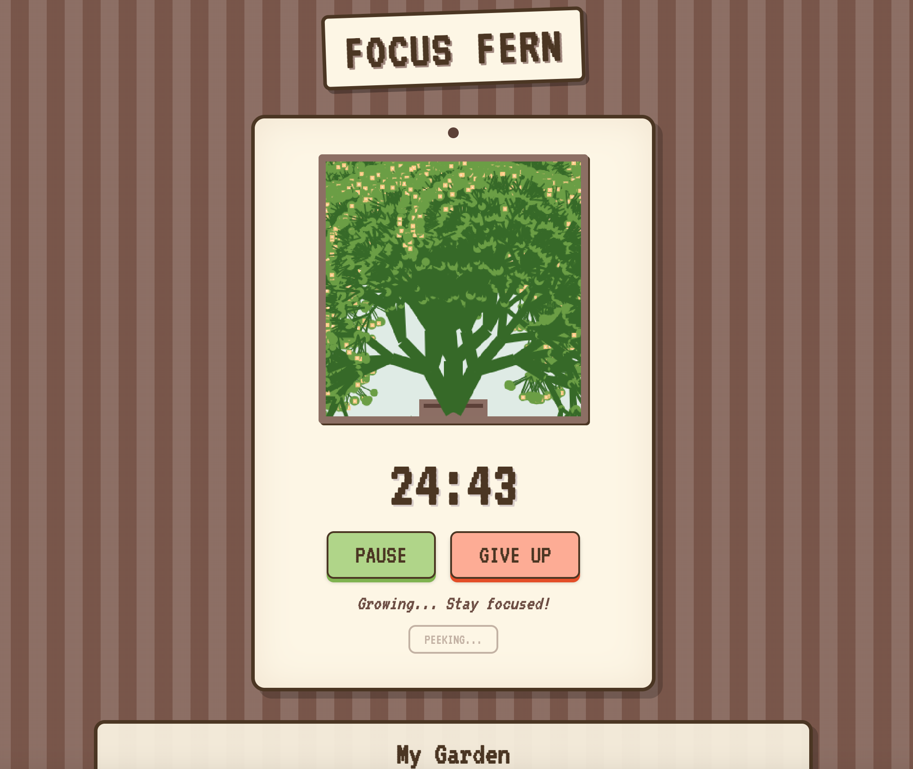

# 🌿 Focus Fern

> **"Don't just watch time pass. Watch something grow."**

**Focus Fern** is a "Cozy Web" productivity tool designed to make deep work feel rewarding, not stressful. Instead of a sterile countdown timer, you nurture a procedurally generated pixel-art plant that grows alongside your focus.

 *(Add a screenshot of your app here)*

## ✨ The Concept
In the spirit of the **Tiny Tool Town** collection, this app is built for "vibes" first.

- **The Hook:** Start a 25-minute focus session, and a seed is planted.
- **The Mechanic:** As you work, the plant grows frame-by-frame using HTML5 Canvas procedural generation.
- **The Stakes:** If you complete the session, the fully grown plant is harvested and added to your permanent "Garden" gallery. If you give up early, the plant withers.
- **The Vibe:** Lo-fi, 8-bit pixel art, and zero anxiety.

## 🛠️ The Stack
This project follows the **Zero Dependency** philosophy. There is no build step, no `node_modules`, and no framework overhead. It will run on a potato.

- **Core:** Vanilla JavaScript (ES6+)
- **Visuals:** HTML5 Canvas (No image assets, every pixel is drawn by code)
- **Persistence:** LocalStorage (Your garden lives in your browser)
- **Styling:** CSS3 variables & Flexbox

## 🚀 Quick Start
Because there are no dependencies, you don't need `npm install`.

1. **Clone the repo**
   ```bash
   git clone [https://github.com/yourusername/focus-fern.git](https://github.com/yourusername/focus-fern.git)